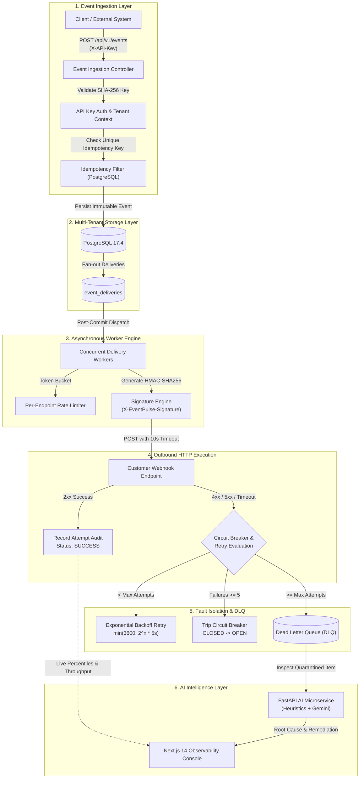

# EventPulse ⚡

> **AI-Powered Distributed Webhook Delivery & Observability Platform**  
> *Engineered for mission-critical reliability, cryptographic integrity, and automated incident diagnosis.*

---

## 🎯 Architecture Overview

EventPulse is an enterprise-grade distributed webhook delivery engine and real-time observability platform. It is designed to solve the hardest problems in asynchronous event delivery: **exactly-once database idempotency**, **multi-tenant isolation**, **cryptographic replay-attack prevention**, **cascading-failure circuit breaking**, and **instant AI root-cause diagnostics**.



---

## 🌟 Key Technical Features

### 1. Multi-Tenant Core with Strict Partitioning
- Tenant isolation enforced on every query via `organizationId`.
- Users and project API keys are cryptographically partitioned; requests across tenant boundaries are rejected with HTTP 404/401.

### 2. Dual-Layer Authentication Architecture
- **Dashboard Operators:** Stateless JWT bearer tokens (`Authorization: Bearer <token>`) with claim-based tenant context (`userId`, `organizationId`).
- **External Ingestion Engines:** Cryptographic API keys (`X-API-Key: ep_live_<prefix>_<secret>`). Keys are hashed using SHA-256 before storage; plaintext keys are never persisted.

### 3. Database-Enforced Exactly-Once Idempotency
- Unique compound constraint `(project_id, idempotency_key)` enforced at the database level.
- Resending an event with the same idempotency key returns the original event record immediately with `"idempotent": true`, preventing duplicate outbound webhooks.

### 4. Cryptographic HMAC-SHA256 Webhook Signatures
- Every outbound webhook includes standard signature headers to prevent spoofing and replay attacks:
  ```http
  X-EventPulse-Signature: t=1710000000,v1=a1b2c3d4e5f6...
  X-EventPulse-Timestamp: 1710000000
  X-EventPulse-Event-Id: 9e3c18f4-a2b0-4589-a878-f06183c5120f
  X-EventPulse-Delivery-Id: 8bd753e6-fd45-4104-9d6f-a3707113a83f
  ```
- Computed using HMAC-SHA256 across `timestamp + "." + raw_payload` using the endpoint's unique `whsec_...` secret token.

### 5. Resilient Delivery Engine & Circuit Breaker
- **Concurrency:** Managed async worker pool with post-commit transactional dispatching.
- **Rate Limiting:** Sliding-window token bucket prevents overwhelming recipient servers beyond their configured requests/minute.
- **Exponential Backoff:** Retries are scheduled via `\text{delay} = \min(3600, 2^{\text{attempt}} \times 5\text{s})`.
- **Circuit Breaker:** State machine (`CLOSED` &rarr; `OPEN` &rarr; `HALF_OPEN`). After 5 consecutive failures, the endpoint is isolated to prevent resource exhaustion. Probes automatically test recovery after 60 seconds.

### 6. Dead Letter Queue (DLQ) & Remediation
- Quarantines events whose retry budget has been exhausted.
- Operators can inspect execution logs, run AI failure diagnostics, manually redeliver with attempt count reset, or discard items.

### 7. AI Root-Cause Diagnostic Microservice
- FastAPI Python microservice analyzes HTTP response bodies, error messages, and network traces.
- Categorizes failures (`AUTHENTICATION_FAILURE`, `ENDPOINT_NOT_FOUND`, `TIMEOUT`, `RECEIVER_SERVER_ERROR`, `SCHEMA_VALIDATION_ERROR`).
- Generates human-readable explanations and remediation checklists.
- Includes embedded resilient fallback heuristics in Spring Boot ensuring high availability even if Python microservice is paused.

### 8. Premium Developer SaaS Frontend
- **Framework:** Next.js 14, React 18, TypeScript, Tailwind CSS.
- **Aesthetics:** Obsidian dark theme, glassmorphic cards, custom glowing indicators.
- **Visualizations:** Interactive 3D particle constellation canvas on hero, visual pipeline stage explorer, live delivery waterfall drawer, and real-time polling.

---

## 🛠 Tech Stack

| Layer | Technologies |
|---|---|
| **Backend** | Java 21, Spring Boot 3.4.0, Spring Security 6, Spring Data JPA, JJWT 0.12.6, Maven |
| **Database** | PostgreSQL 17.4, Flyway Database Migrations (`V1`, `V2`), HikariCP |
| **AI Microservice**| Python 3.11, FastAPI, Uvicorn, Pydantic, HTTPX, Google Gemini API |
| **Frontend** | Next.js 14 (App Router), TypeScript, Tailwind CSS, Lucide Icons |
| **DevOps** | Docker, Docker Compose, Multi-stage Dockerfiles |

---

## 🚀 Quickstart & Setup

### Option 1: Docker Compose (One-Click)

Ensure Docker Desktop is running, then run from the repository root:

```bash
# 1. Copy environment template
cp .env.example .env

# 2. Build and launch all services
docker compose up --build
```

Services will be available at:
- **Web Console:** [http://localhost:3000](http://localhost:3000)
- **Spring Boot API:** [http://localhost:8081](http://localhost:8081)
- **FastAPI AI Service:** [http://localhost:8000](http://localhost:8000)
- **PostgreSQL:** `localhost:5432`

---

### Option 2: Local Development

#### Prerequisites
- Java 21 JDK
- Node.js 20+ & npm
- Python 3.11+
- PostgreSQL 17 running on `localhost:5432` with database `eventpulse`

#### 1. Backend Setup
```bash
cd backend

# Verify database password is set
$env:SPRING_DATASOURCE_PASSWORD="your_postgres_password"

# Run migrations and backend tests
.\mvnw.cmd test

# Start the Spring Boot application on port 8081
.\mvnw.cmd spring-boot:run
```

#### 2. AI Microservice Setup
```bash
cd ai-service

# Create virtual environment
python -m venv venv
.\venv\Scripts\activate

# Install dependencies and start server
pip install -r requirements.txt
uvicorn main:app --host 0.0.0.0 --port 8000 --reload
```

#### 3. Frontend Setup
```bash
cd frontend

# Install packages
npm install

# Start Next.js development server on port 3000
npm run dev
```

Visit [http://localhost:3000](http://localhost:3000) to open the EventPulse console.

---

## 📖 REST API Reference & Examples

### 1. Tenant Registration & Authentication

#### Register Organization & User
```bash
curl -X POST http://localhost:8081/api/auth/register \
  -H "Content-Type: application/json" \
  -d '{
    "organizationName": "Acme Cloud",
    "email": "operator@acme.com",
    "password": "SuperSecretPassword123!"
  }'
```

#### Sign In (Get JWT Bearer Token)
```bash
curl -X POST http://localhost:8081/api/auth/login \
  -H "Content-Type: application/json" \
  -d '{
    "organizationId": "<ORGANIZATION_UUID>",
    "email": "operator@acme.com",
    "password": "SuperSecretPassword123!"
  }'
```

---

### 2. Project & API Key Management

#### Create Project
```bash
curl -X POST http://localhost:8081/api/projects \
  -H "Authorization: Bearer <JWT_TOKEN>" \
  -H "Content-Type: application/json" \
  -d '{"name": "Billing & Checkout"}'
```

#### Generate API Ingestion Key
```bash
curl -X POST http://localhost:8081/api/projects/<PROJECT_UUID>/api-keys \
  -H "Authorization: Bearer <JWT_TOKEN>" \
  -H "Content-Type: application/json" \
  -d '{"name": "Production Dispatcher"}'
```
*Response returns the plaintext key `apiKey: "ep_live_..."` once.*

---

### 3. Webhook Endpoints & Circuit Breakers

#### Register Webhook Endpoint
```bash
curl -X POST http://localhost:8081/api/projects/<PROJECT_UUID>/endpoints \
  -H "Authorization: Bearer <JWT_TOKEN>" \
  -H "Content-Type: application/json" \
  -d '{
    "name": "Customer Webhook Receiver",
    "url": "https://httpbin.org/post",
    "rateLimitPerMinute": 120
  }'
```

#### Reset Tripped Circuit Breaker
```bash
curl -X POST http://localhost:8081/api/projects/<PROJECT_UUID>/endpoints/<ENDPOINT_UUID>/reset-circuit \
  -H "Authorization: Bearer <JWT_TOKEN>"
```

---

### 4. Event Ingestion (Machine-to-Machine)

#### Ingest Event with Idempotency Key
```bash
curl -X POST http://localhost:8081/api/v1/events \
  -H "X-API-Key: ep_live_abcdef12_..." \
  -H "Content-Type: application/json" \
  -d '{
    "eventType": "invoice.payment_succeeded",
    "idempotencyKey": "inv_99812_attempt_1",
    "payload": {
      "invoiceId": "inv_99812",
      "amount": 25000,
      "customer": "cus_4412"
    }
  }'
```

---

### 5. Dead-Letter Queue (DLQ) & Observability

#### List Quarantined Events
```bash
curl -X GET http://localhost:8081/api/projects/<PROJECT_UUID>/dlq \
  -H "Authorization: Bearer <JWT_TOKEN>"
```

#### Retry Quarantined DLQ Item
```bash
curl -X POST http://localhost:8081/api/projects/<PROJECT_UUID>/dlq/<DLQ_UUID>/retry \
  -H "Authorization: Bearer <JWT_TOKEN>"
```

#### Query Real-Time Platform Analytics
```bash
curl -X GET http://localhost:8081/api/projects/<PROJECT_UUID>/analytics \
  -H "Authorization: Bearer <JWT_TOKEN>"
```

#### Run AI Failure Diagnostics
```bash
curl -X GET http://localhost:8081/api/projects/<PROJECT_UUID>/deliveries/<DELIVERY_UUID>/ai-analysis \
  -H "Authorization: Bearer <JWT_TOKEN>"
```

---

## 🗄 Database Schema & Migrations

EventPulse manages schema evolution using Flyway migrations with Hibernate strict validation (`spring.jpa.hibernate.ddl-auto=validate`):

- **`V1__create_initial_multi_tenant_schema.sql`**:
  - `organizations`: Tenant metadata and timestamps.
  - `users`: Operator accounts with BCrypt-hashed credentials.
  - `projects`: Isolated namespaces within an organization.
- **`V2__create_eventpulse_core_schema.sql`**:
  - `api_keys`: SHA-256 hashed API keys with `key_prefix` and expiration.
  - `webhook_endpoints`: URLs, `whsec_` HMAC secret tokens, circuit breaker states (`CLOSED`, `OPEN`, `HALF_OPEN`), and rate limits.
  - `events`: Immutable event log with compound uniqueness `(project_id, idempotency_key)`.
  - `event_deliveries`: Delivery state machine, exponential retry scheduling, latency tracking.
  - `delivery_attempts`: Append-only audit table with exact HTTP request and response snapshots.
  - `dead_letter_events`: Quarantined events after exhausted retries for manual or automated resolution.

---

## 🧪 Verification & Test Suite

The backend includes a comprehensive unit and integration test suite:
- **`EventPulseApplicationTests`**: Context bootstrap and database health check verification.
- **`RepositoryIntegrationTest`**: Flyway migrations and multi-tenant constraints verification.
- **`AuthRegistrationTest`**: Organization and user provisioning, validation error handling.
- **`AuthLoginTest`**: BCrypt authentication, JWT claims validation, expiry checks, protected endpoint gating.
- **`ProjectAndEndpointIntegrationTest`**: Multi-tenant isolation, project CRUD, API key lifecycle, circuit breaker reset.
- **`EventIngestionAndDeliveryIntegrationTest`**: `X-API-Key` authentication, database idempotency guarantees, analytics percentiles.

Run all tests:
```bash
cd backend
.\mvnw.cmd test
```
---

## 📚 Comprehensive Documentation Suite

For detailed technical references, visit the `docs/` directory:
- [System Architecture](docs/architecture.md) — Multi-tenant design, async dispatcher, resilience patterns, and ER diagrams.
- [REST API Reference](docs/api.md) — Comprehensive endpoints, authentication headers, request/response DTOs, and error codes.
- [Local Development Guide](docs/local-development.md) — Setup prerequisites, environment configurations, and run instructions.
- [Testing Strategy & Test Suite](docs/testing.md) — Unit tests, integration tests, and the 64-assertion HTTP red-team verification suite.
- [System Design & Interview Guide](docs/interview.md) — Distributed systems invariants, trade-offs, and high-frequency technical interview questions.

---

## 📄 License
This project is open-source and available under the [MIT License](LICENSE).
